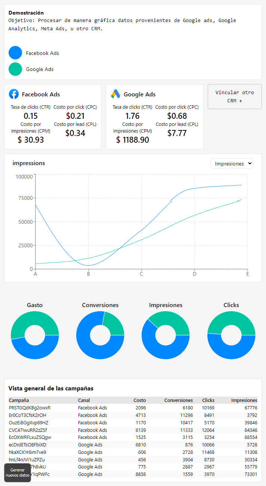
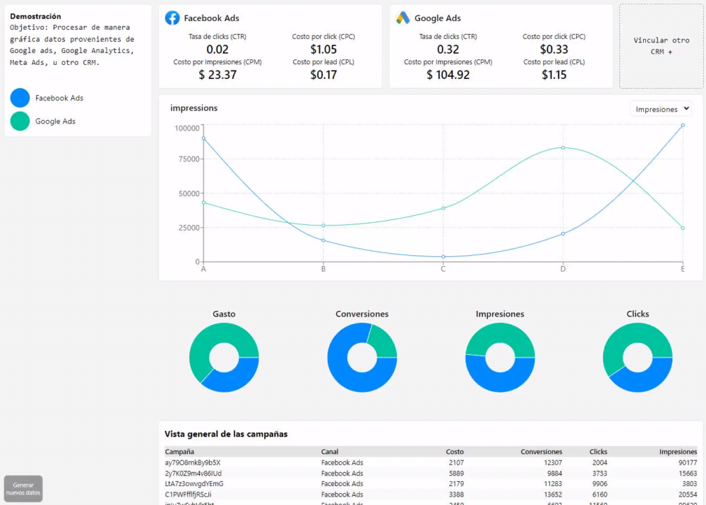
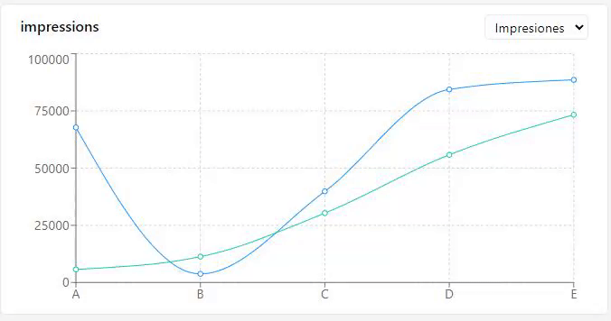

## Dashboard

Para este proyecto se realizo el desarrollo de una interfaz que simula respuestas de la API de Google Ads y Meta Ads siguiendo su estructura de respuestas de la API ofreciendo insights diversas CTR, CPM, CPC, CPL.



### Elecciones de diseño

EL diseño general sigue una idea minimalista, no se utilizaron librerías de componentes terceros, finalmente se eligió utilizar Tailwind CSS para el estilado. La paleta de colores utilizado fue la linea de "Neutral".

### Botón flotante

Se añadió un botón en la parte inferior izquierda para simular datos diferentes y mostrar el dinamismo de la interfaz.



### Gráfico lineal

Se añadió un `<select>` para ahorrar espacio en pantalla y aun asi poder mostrar gráficamente diversas comparaciones en forma de gráfico lineal, esas mismas proporciones posteriormente se muestran con gráficos de pastel como KPI.



### Ejecución en producción

```
npm install
npm run build
npm run start
```
